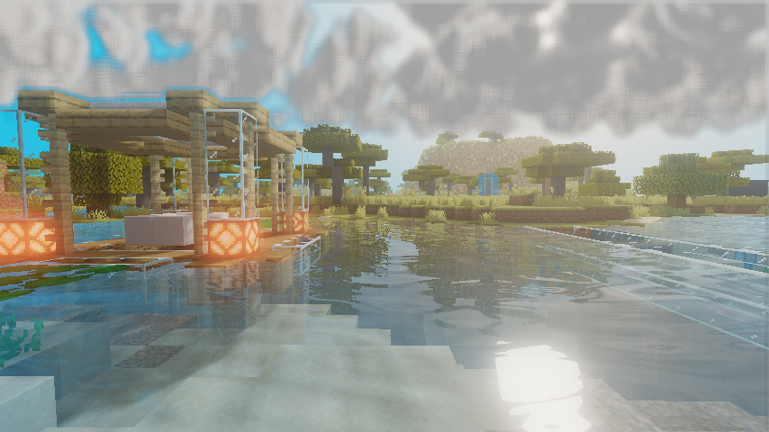
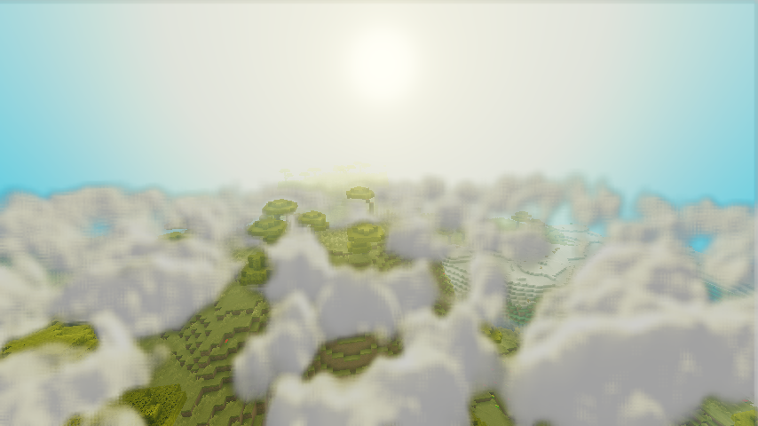
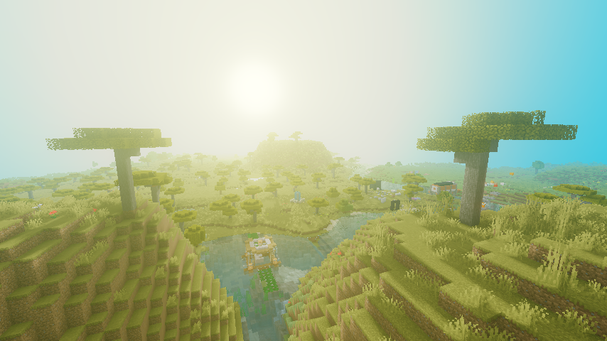
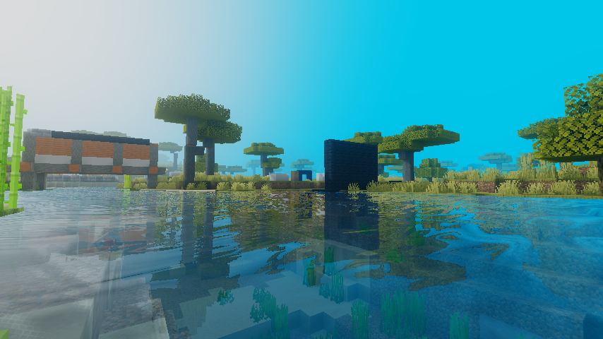
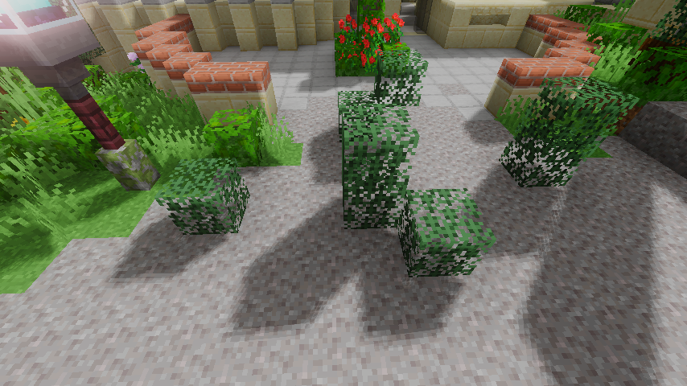
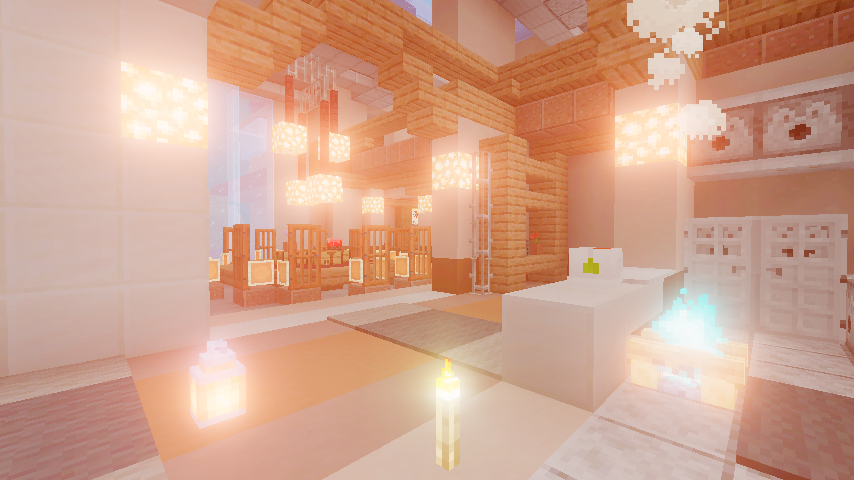
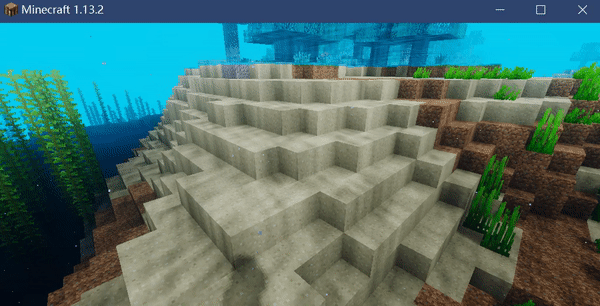

<<<<<<< HEAD
=======

>>>>>>> 7064bf5c6cb63d7ce1d069851ed703b112210507
# Hello Minecraft Shaders

**Hello Minecraft Shaders (HMS)** is a simple tutorial (including .md and .pdf files) about how to programming shaders for Minecraft, based on [Optifine mod](https://github.com/sp614x/optifine) environment

it was written when my junior years, which I most likely to named it 摆烂的大三. so it may has some problems including poor graphic performance, buggy rendering effect and hard-to-read code, what's more? I have no idea how it can compatible with [Iris mod](https://github.com/IrisShaders/Iris)

# Features

Volume Cloud with Ray Marching (tracing on 1/4 resolution for speed) ：

Atmosphere and fog simulate：

Screen Space Reflection (SSR) with ray marching and Fresnel Reflection：

PCF soft shadow mapping：

Bloom with Mipmap, down sample and gauss blur：

Caustics simulate with noise texture and sine & cosine wave：

# Install it to MC

1. first u need install OptifineHD mod
2. then copy the shader package file to game directory `.minecraft/shaderpacks`
3. select it in game meun：`vedio setting --> shades`

# Reading online 

[从0开始编写minecraft光影包（0）GLSL，坐标系，光影包结构介绍](https://blog.csdn.net/weixin_44176696/article/details/108152896)

[从零开始编写minecraft光影包（1）基础阴影绘制](https://blog.csdn.net/weixin_44176696/article/details/108625077)

[从零开始编写minecraft光影包（2）阴影优化](https://blog.csdn.net/weixin_44176696/article/details/108637819)

[从零开始编写minecraft光影包（3）基础泛光绘制](https://blog.csdn.net/weixin_44176696/article/details/108672719)

[从零开始编写minecraft光影包（4）泛光性能与品质优化](https://blog.csdn.net/weixin_44176696/article/details/108692525)

[从零开始编写minecraft光影包（5）简单光照系统，曝光调节，色调映射与饱和度](https://blog.csdn.net/weixin_44176696/article/details/108909824)

[从零开始编写minecraft光影包（6）天空绘制](https://blog.csdn.net/weixin_44176696/article/details/108943499)

[从零开始编写minecraft光影包（7）基础水面绘制](https://blog.csdn.net/weixin_44176696/article/details/108951799)

[从零开始编写minecraft光影包（8）中级水面绘制 水下阴影与焦散](https://blog.csdn.net/weixin_44176696/article/details/108984693)

[从零开始编写minecraft光影包（9）高级水面绘制 反射与屏幕空间反射](https://blog.csdn.net/weixin_44176696/article/details/109189603)

# Reference

[1] 白玉楼之梦 - szszss' blog, ["如何编写Shadersmod光影包"](http://blog.hakugyokurou.net/)

[2] sp614x (Github), "[optifine document](https://github.com/sp614x/optifine)"

[3] iq (shadertoy), ["raymarching clouds with fbm"](https://www.shadertoy.com/view/XslGRr)

